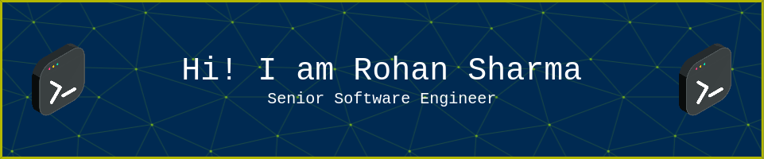

## About Me

- 🚀 **Software Engineer** with 5+ years of backend development experience
- 🎓 B.Tech in Computer Science (2018) | Planning to pursue M.Tech
- 🛠️ **Skills:** Python, FastAPI, Flask, Django, MySQL, MongoDB, Redis, AWS
- 🌍 Seeking new opportunities | Available from October 2024

## Let's Connect

- 📄 [Resume](https://github.com/grep-rohan/grep-rohan/blob/main/resume.pdf)
- 💻 [LinkedIn](https://linkedin.com/in/rohansharma95)  
- 📧 irohansharma95@gmail.com
